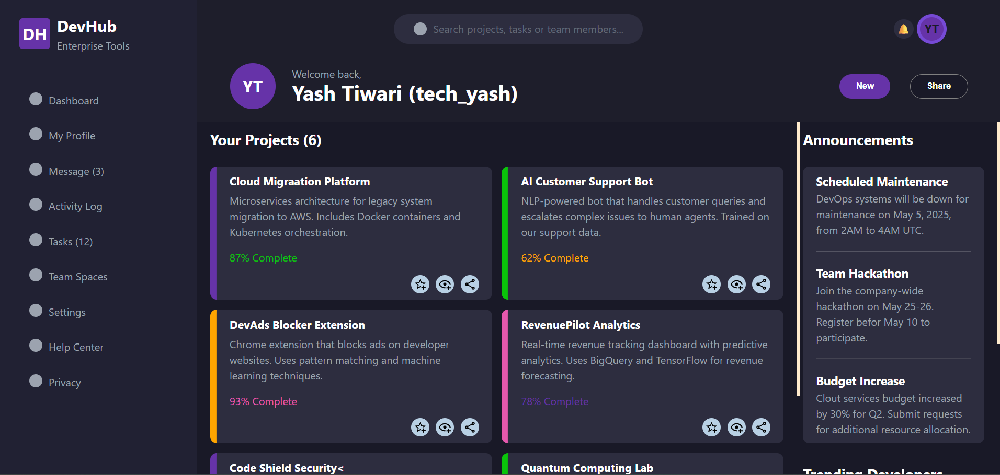

# Odin Admin Dashboard

This is a responsive Admin Dashboard project built as part of [The Odin Project](https://www.theodinproject.com/) curriculum. It focuses on practicing advanced CSS layout techniques, especially CSS Grid, along with clean UI structuring.

## Live Demo

[View Live Project](https://yashrtech.github.io/Odin-Admin-Dashboard/)

## Screenshots

## Features

- Sidebar navigation menu
- Header with search and user options
- Dashboard content area with:
  - Project cards
  - Announcements section
  - Trending users panel
- Hover effects and clean UI

## Built With

- HTML5
- CSS3
- CSS Grid

## What I Learned

- Creating complex layouts using **CSS Grid**
- Building reusable UI components with HTML/CSS
- Improving visual hierarchy and dashboard design
- Structuring code for maintainability
